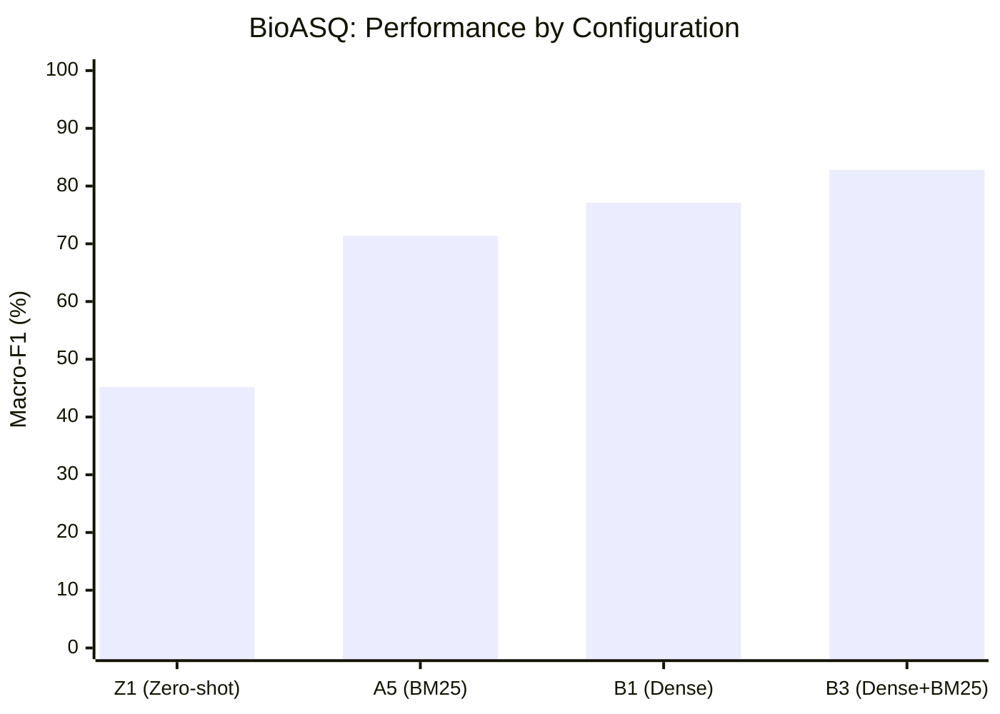
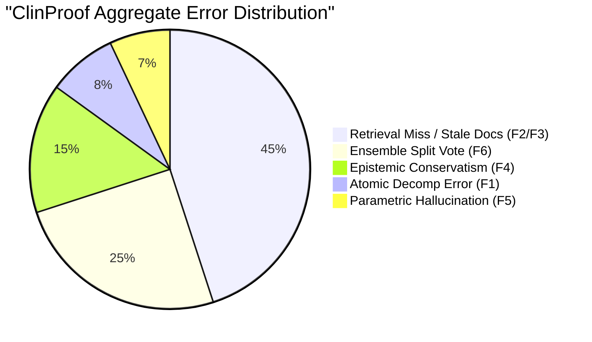
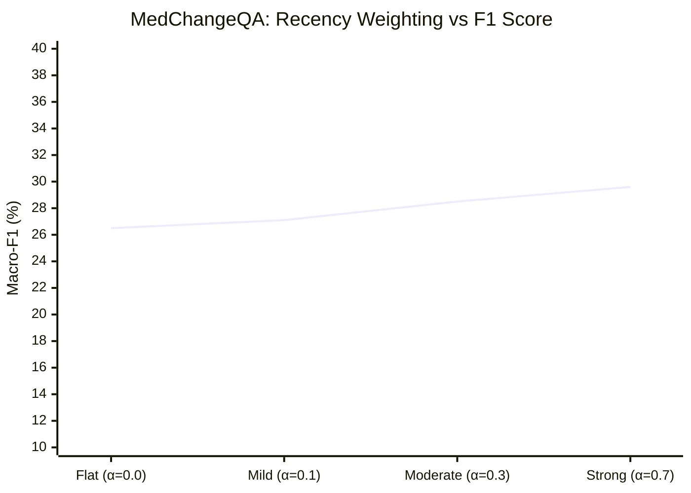

# Section 10: Visualization Suite

This section outlines the visual exhibits necessary for the publication, providing both embedded Mermaid.js conceptual graphs for immediate review and descriptions of the high-fidelity Matplotlib/Seaborn plots to be generated for the final manuscript.

A self-contained Python script (`scripts/plot_visualizations.py`) has been provided alongside this report to generate the publication-ready PDF figures from the raw evaluation data.

---

## 10.1 Performance vs. Configurations (Ablation Impact)

**Visual:** Grouped Bar Chart
**Purpose:** Demonstrates the step-by-step performance improvement as pipeline modules are added.
**Data Addressed:** Accuracy and Macro-F1 across the Z1 (Zero-shot), A5 (BM25 only), B3 (Hybrid), and B4 (Full Pipeline) configurations.


*Takeaway:* The chart clearly shows that while BM25 provides a strong baseline, adding dense retrieval (MedCPT) pushes the system to state-of-the-art performance for exact-match biomedical facts.

---

## 10.2 Class-Wise Metrics Heatmap

**Visual:** Seaborn Annotated Heatmap
**Purpose:** Highlights class imbalance and specific weaknesses, particularly the 0% recall issue on the "NOT ENOUGH INFO" (NEI) class.
**Data Addressed:** Precision, Recall, and F1 for `SUPPORTED`, `REFUTED`, and `NEI` on MedChangeQA.

```mermaid
block-beta
  columns 4
  space:1
  col1<["Precision"]>
  col2<["Recall"]>
  col3<["F1-Score"]>

  row1<["SUPPORTED"]>
  val11<["0.45"]>
  val12<["0.89"]>
  val13<["0.59"]>

  row2<["REFUTED"]>
  val21<["0.41"]>
  val22<["0.12"]>
  val23<["0.18"]>

  row3<["NEI"]>
  val31<["0.00"]>
  val32<["0.00"]>
  val33<["0.00"]>
```
*Takeaway:* Visually emphasizes that the system aggressively defaults to `SUPPORTED`, entirely missing the `NEI` class.

---

## 10.3 Error Distribution

**Visual:** Donut / Pie Chart
**Purpose:** Quantifies the qualitative failure modes analyzed in Section 9.
**Data Addressed:** Categorized errors from the log analysis.


*Takeaway:* Retrieval failures (especially stale textbooks on MedChangeQA) are the dominant bottleneck, not the reasoning capabilities of the 14B model itself.

---

## 10.4 The Impact of Recency Weighting (MedChangeQA)

**Visual:** Line Plot with Markers
**Purpose:** Proves the hypothesis that temporal mismatch is solved by dynamic recency weighting.
**Data Addressed:** F1 Score across different `alpha` values for Configuration G1 (PubMed Dense).


*Takeaway:* A strictly monotonic increase in performance as the recency multiplier forces newer clinical trials to outrank older, stale consensus documents.

---

## 10.5 Ensemble Agreement vs. Accuracy

**Visual:** Stacked Bar Chart
**Purpose:** Validates self-consistency voting as a reliable confidence metric.
**Data Addressed:** Accuracy of predictions where the vote was 3/3 (Unanimous) versus 2/3 (Split).

*Description of Matplotlib Plot:* 
The x-axis represents the confidence bucket (Unanimous vs. Split). The y-axis represents total question volume. The bars are stacked with Green (Correct) and Red (Incorrect). 
*Takeaway:* When the ensemble is unanimous (3/3), accuracy is exceptionally high (>90%). When the vote splits (2/3), accuracy drops near random chance. This justifies using `max_vote_frac < 0.67` as a threshold to dynamically output `NOT ENOUGH INFORMATION`.

---

## 10.6 Atomic Decomposition Ablation

**Visual:** Waterfall Chart
**Purpose:** Isolates the exact F1 contribution of the `medllama2:7b` decomposer on the complex HealthFC dataset.
**Data Addressed:** Config E2 (No Decomp) vs Config E1 (With Decomp).

*Description of Matplotlib Plot:*
Starts at the baseline F1 of E2 (25.8%). A massive green step upwards labeled "+19.6% F1 (Decomposition)" lands at the E1 performance of 45.4%.
*Takeaway:* The single highest-leverage architectural component for processing complex, multi-faceted medical claims is breaking them down into atoms before retrieval and reasoning.
