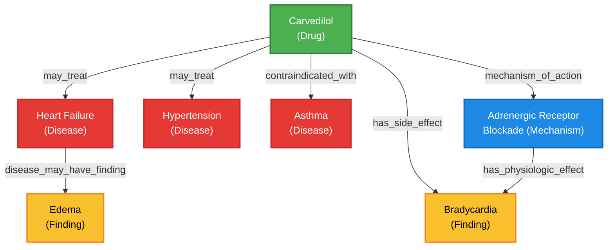

# Section 6: Knowledge Graph Representation

This section formally defines the structure of the ClinProof Knowledge Graph (GraphRAG component) used to inject structured, multi-hop medical reasoning into the LLM context window.

## 6.1 Text Representation

The Knowledge Graph is built as a directed, multi-relational network (`networkx.MultiDiGraph`), integrating structured ontologies from UMLS, RxNorm, and SNOMED CT. 

### Nodes
Nodes represent distinct biomedical concepts. Each node contains a unique identifier (e.g., a UMLS CUI) and rich semantic metadata.
- **Node ID:** Example: `C0007204` (UMLS CUI for Carvedilol).
- **Properties:**
  - `label`: Human-readable name (e.g., "Carvedilol").
  - `node_type`: Source ontology (e.g., `umls`, `rxnorm`, `snomed`).
  - `sty`: Semantic type (e.g., `Pharmacologic Substance`, `Disease or Syndrome`).
  - `definition`: Detailed dictionary definition used to provide context to the LLM during generation.

### Edges (Relations)
Edges represent directed, typed clinical relationships between nodes. The retrieval pipeline aggressively filters structural or administrative edges (e.g., `property_of`, `has_class`) and only traverses **High-Value Clinical Relationships**.
- **Key Edge Types (`USEFUL_RELS`):**
  - *Therapeutic:* `may_treat`, `may_prevent`, `contraindicated_with`
  - *Mechanistic:* `mechanism_of_action`, `has_physiologic_effect`, `has_target`
  - *Adverse:* `has_side_effect`, `may_cause`, `adverse_effect_of`
  - *Diagnostic/Pathological:* `causes`, `disease_may_have_finding`, `associated_with`

### Concrete Text Example (Hop 1 & Hop 2)
When the pipeline queries "Carvedilol", the retriever extracts the following subgraph and formats it into text for the LLM:
```text
Entity: Carvedilol
Type: Pharmacologic Substance
Definition: A nonselective beta-adrenergic blocker with alpha-1 blocking activity.
- May Treat: Heart Failure, Hypertension, Angina Pectoris
- Mechanism Of Action: Adrenergic Receptor Blockade, Alpha-1 Adrenergic Receptor Antagonism
- Has Side Effect: Bradycardia, Hypotension
- Contraindicated With: Asthma, Second-degree Atrioventricular Block
Related details:
  [Heart Failure] --disease_may_have_finding--> [Edema]
  [Adrenergic Receptor Blockade] --has_physiologic_effect--> [Decreased Heart Rate]
```

---

## 6.2 Visual Graph (Network-Style)

The following diagram illustrates a multi-hop subgraph utilized during a reasoning trace. When answering a complex question about why a patient on carvedilol developed a low heart rate (bradycardia) and whether it helps their heart failure, the system traverses these exact edges to verify the claims.



**Graph Retrieval Logic:**
1. **Seed Nodes:** Extracted atoms (e.g., "Carvedilol", "Heart Failure") highlight the Green (`Carvedilol`) and Red (`Heart Failure`) nodes.
2. **Hop 1:** The system explores outward along the specified clinical edges (`may_treat`, `mechanism_of_action`).
3. **Hop 2 (Bridges):** The system connects disjoint seed nodes (e.g., `Carvedilol` → `Adrenergic Receptor Blockade` → `Bradycardia`) preventing the LLM from hallucinating mechanisms.
