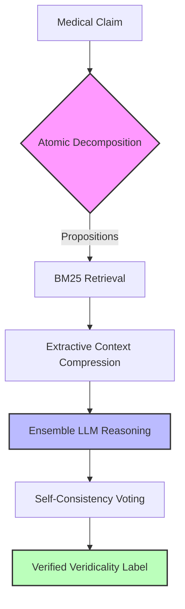

══════════════════════════════════════════════════════════════════════
  ClinProof Comprehensive Analysis
  Results dir: results/v5_ablations/
══════════════════════════════════════════════════════════════════════

## CLINPROOF ARCHITECTURE

---

## 1. ACCURACY SUMMARY

| Tag                                        | Dataset     | Model                         | Decomp | KG | BM25 | PMed | Rec | Votes | N   | Acc    | P      | R      | F1     | Unan% |
| ------------------------------------------ | ----------- | ----------------------------- | ------ | -- | ---- | ---- | --- | ----- | --- | ------ | ------ | ------ | ------ | ----- |
| A3_biomistral_bioasq                       | bioasq      | biomistral                    | ✓     | ✗ | ✓   | ✗   | 0.0 | 1     | 151 | 82.1%  | 41.1%  | 50.0%  | 45.1%  | 100%  |
| A5_mistral7b_bioasq                        | bioasq      | mistral                       | ✓     | ✗ | ✓   | ✗   | 0.0 | 1     | 151 | 80.8%  | 65.7%  | 57.9%  | 59.6%  | 100%  |
| A6_qwen14b_nokgbm25_bioasq                 | bioasq      | qwen2.5                       | ✓     | ✗ | ✓   | ✗   | 0.0 | 3     | 133 | 81.2%  | 67.4%  | 68.0%  | 67.7%  | 89%   |
| C1_bm25_flat_medchangeqa                   | medchangeqa | qwen2.5                       | ✓     | ✗ | ✓   | ✗   | 0.0 | 3     | 512 | 39.1%  | 36.7%  | 35.0%  | 33.0%  | 81%   |
| C2_bm25_recency_a0.3_medchangeqa           | medchangeqa | qwen2.5                       | ✓     | ✗ | ✓   | ✗   | 0.3 | 3     | 512 | 38.7%  | 36.3%  | 34.5%  | 32.3%  | 82%   |
| C3_bm25_recency_a0.7_medchangeqa           | medchangeqa | qwen2.5                       | ✓     | ✗ | ✓   | ✗   | 0.7 | 3     | 451 | 35.9%  | 29.8%  | 32.2%  | 28.7%  | 77%   |
| D1_qwen14b_1vote_bioasq                    | bioasq      | qwen2.5                       | ✓     | ✗ | ✓   | ✗   | 0.0 | 1     | 166 | 77.1%  | 63.9%  | 66.5%  | 64.9%  | 100%  |
| D2_qwen14b_3vote_bioasq                    | bioasq      | qwen2.5                       | ✓     | ✗ | ✓   | ✗   | 0.0 | 3     | 152 | 80.9%  | 67.6%  | 68.1%  | 67.8%  | 88%   |
| D4_medensemble_3_bioasq                    | bioasq      | meditron,medllama2,biomistral | ✓     | ✗ | ✓   | ✗   | 0.0 | 3     | 93  | 84.9%  | 42.5%  | 50.0%  | 45.9%  | 96%   |
| D5_hybridensemble_3_bioasq                 | bioasq      | qwen2.5,meditron,llama3.1     | ✓     | ✗ | ✓   | ✗   | 0.0 | 3     | 16  | 100.0% | 100.0% | 100.0% | 100.0% | 50%   |
| E1_qwen14b_3vote_with_decomp_healthfc_test | healthfc    | qwen2.5                       | ✓     | ✗ | ✓   | ✗   | 0.0 | 3     | 59  | 61.0%  | 100.0% | 61.0%  | 75.8%  | 85%   |
| E2_qwen14b_3vote_no_decomp_healthfc_test   | healthfc    | qwen2.5                       | ✓     | ✗ | ✓   | ✗   | 0.0 | 3     | 75  | 44.0%  | 100.0% | 44.0%  | 61.1%  | 71%   |

## 2. PER-CLASS PRECISION / RECALL / F1

  [A3] BIOASQ  Model=biomistral  n=151

| Class              | Precision       | Recall              | F1    | Support | TP  |
| ------------------ | --------------- | ------------------- | ----- | ------- | --- |
| A                  | 82.1%           | 100.0%              | 90.2% | 124     | 124 |
| B                  | 0.0%            | 0.0%                | 0.0%  | 27      | 0   |
| → Macro-F1: 45.1% | Unanimous: 100% | AvgWinnerFrac: 1.00 |       |         |     |

  [A5] BIOASQ  Model=mistral  n=151

| Class              | Precision       | Recall              | F1    | Support | TP  |
| ------------------ | --------------- | ------------------- | ----- | ------- | --- |
| A                  | 85.3%           | 93.5%               | 89.2% | 124     | 116 |
| B                  | 46.2%           | 22.2%               | 30.0% | 27      | 6   |
| → Macro-F1: 59.6% | Unanimous: 100% | AvgWinnerFrac: 1.00 |       |         |     |

  [A6] BIOASQ  Model=qwen2.5  n=133

| Class              | Precision      | Recall              | F1    | Support | TP |
| ------------------ | -------------- | ------------------- | ----- | ------- | -- |
| A                  | 89.0%          | 88.2%               | 88.6% | 110     | 97 |
| B                  | 45.8%          | 47.8%               | 46.8% | 23      | 11 |
| → Macro-F1: 67.7% | Unanimous: 89% | AvgWinnerFrac: 0.96 |       |         |    |

  [C1] MEDCHANGEQA  Model=qwen2.5  n=512

| Class              | Precision      | Recall              | F1    | Support | TP  |
| ------------------ | -------------- | ------------------- | ----- | ------- | --- |
| A                  | 43.4%          | 56.6%               | 49.1% | 221     | 125 |
| B                  | 33.3%          | 8.4%                | 13.4% | 131     | 11  |
| C                  | 33.5%          | 40.0%               | 36.5% | 160     | 64  |
| → Macro-F1: 33.0% | Unanimous: 81% | AvgWinnerFrac: 0.94 |       |         |     |

  [C2] MEDCHANGEQA  Model=qwen2.5  n=512

| Class              | Precision      | Recall              | F1    | Support | TP  |
| ------------------ | -------------- | ------------------- | ----- | ------- | --- |
| A                  | 44.2%          | 57.0%               | 49.8% | 221     | 126 |
| B                  | 33.3%          | 7.6%                | 12.4% | 131     | 10  |
| C                  | 31.5%          | 38.8%               | 34.7% | 160     | 62  |
| → Macro-F1: 32.3% | Unanimous: 82% | AvgWinnerFrac: 0.94 |       |         |     |

  [C3] MEDCHANGEQA  Model=qwen2.5  n=451

| Class              | Precision      | Recall              | F1    | Support | TP |
| ------------------ | -------------- | ------------------- | ----- | ------- | -- |
| A                  | 43.2%          | 48.8%               | 45.8% | 201     | 98 |
| B                  | 16.7%          | 2.6%                | 4.5%  | 115     | 3  |
| C                  | 29.6%          | 45.2%               | 35.8% | 135     | 61 |
| → Macro-F1: 28.7% | Unanimous: 77% | AvgWinnerFrac: 0.92 |       |         |    |

  [D1] BIOASQ  Model=qwen2.5  n=166

| Class              | Precision       | Recall              | F1    | Support | TP  |
| ------------------ | --------------- | ------------------- | ----- | ------- | --- |
| A                  | 88.3%           | 83.1%               | 85.6% | 136     | 113 |
| B                  | 39.5%           | 50.0%               | 44.1% | 30      | 15  |
| → Macro-F1: 64.9% | Unanimous: 100% | AvgWinnerFrac: 1.00 |       |         |     |

  [D2] BIOASQ  Model=qwen2.5  n=152

| Class              | Precision      | Recall              | F1    | Support | TP  |
| ------------------ | -------------- | ------------------- | ----- | ------- | --- |
| A                  | 88.7%          | 88.0%               | 88.4% | 125     | 110 |
| B                  | 46.4%          | 48.1%               | 47.3% | 27      | 13  |
| → Macro-F1: 67.8% | Unanimous: 88% | AvgWinnerFrac: 0.96 |       |         |     |

  [D4] BIOASQ  Model=meditron,medllama2,biomis  n=93

| Class              | Precision      | Recall              | F1    | Support | TP |
| ------------------ | -------------- | ------------------- | ----- | ------- | -- |
| A                  | 84.9%          | 100.0%              | 91.9% | 79      | 79 |
| B                  | 0.0%           | 0.0%                | 0.0%  | 14      | 0  |
| → Macro-F1: 45.9% | Unanimous: 96% | AvgWinnerFrac: 0.99 |       |         |    |

  [D5] BIOASQ  Model=qwen2.5,meditron,llama3.1  n=16

| Class               | Precision      | Recall              | F1     | Support | TP |
| ------------------- | -------------- | ------------------- | ------ | ------- | -- |
| A                   | 100.0%         | 100.0%              | 100.0% | 15      | 15 |
| B                   | 100.0%         | 100.0%              | 100.0% | 1       | 1  |
| → Macro-F1: 100.0% | Unanimous: 50% | AvgWinnerFrac: 0.83 |        |         |    |

  [E1] HEALTHFC  Model=qwen2.5  n=59

| Class              | Precision      | Recall              | F1    | Support | TP |
| ------------------ | -------------- | ------------------- | ----- | ------- | -- |
| C                  | 100.0%         | 61.0%               | 75.8% | 59      | 36 |
| → Macro-F1: 75.8% | Unanimous: 85% | AvgWinnerFrac: 0.94 |       |         |    |

  [E2] HEALTHFC  Model=qwen2.5  n=75

| Class              | Precision      | Recall              | F1    | Support | TP |
| ------------------ | -------------- | ------------------- | ----- | ------- | -- |
| C                  | 100.0%         | 44.0%               | 61.1% | 75      | 33 |
| → Macro-F1: 61.1% | Unanimous: 71% | AvgWinnerFrac: 0.90 |       |         |    |

## 3. ERROR ANALYSIS (Wrong Predictions)

  [A3] BIOASQ
  Wrong=27  Correct=124
  Error categories: {'unanimous_wrong': 27}
  Wrong pred dist:  {'A': 27}
  Confusion (gt→pred): {'B': {'A': 27}}

  Sample wrong cases (first 3):

    ID=58dbb4f08acda3452900001a
    Q : Is Lennox-Gastaut Syndrome usually diagnosed in older adults?
    GT: B  PRED: Yes  Votes: {'A': 1}
    Context:
Document [1] (Title: Atomic Propositions)  Key medical claims to verify:

- Lennox-Gastaut Syndrome ...
  Reasoning: ...

  ID=5540a8d20083d1bf0e000001
  Q : Does a selective sweep increase genetic variation?
  GT: B  PRED: Yes  Votes: {'A': 1}
  Context:
  Document [1] (Title: Atomic Propositions)  Key medical claims to verify:
- a selective sweep can in...
  Reasoning: ...

  ID=5a8714e261bb38fb24000005
  Q : Is polyadenylation a process that stabilizes a protein by adding a string of Adenosine residues to the end of the molecu
  GT: B  PRED: Yes  Votes: {'A': 1}
  Context:
  Document [1] (Title: Atomic Propositions)  Key medical claims to verify:
- polyadenylation is a pro...
  Reasoning: ...

  [A5] BIOASQ
  Wrong=29  Correct=122
  Error categories: {'unanimous_wrong': 29}
  Wrong pred dist:  {'B': 7, 'A': 20, 'C': 2}
  Confusion (gt→pred): {'A': {'B': 7, 'C': 1}, 'B': {'A': 20, 'C': 1}}

  Sample wrong cases (first 3):

  ID=5321bb019b2d7acc7e00000b
  Q : Is low T3 syndrome related with high BNP in cardiac patients?
  GT: A  PRED: No  Votes: {'B': 1}
  Context:
  Document [1] (Title: Atomic Propositions)  Key medical claims to verify:
- low T3 levels are associ...
  Reasoning: {"step_by_step_thinking": [
  "Document [2] discusses the low T3 syndrome (low total and unbound T3 levels) in sick euthyroid syndrome. This condition m...

  ID=5540a8d20083d1bf0e000001
  Q : Does a selective sweep increase genetic variation?
  GT: B  PRED: Yes  Votes: {'A': 1}
  Context:
  Document [1] (Title: Atomic Propositions)  Key medical claims to verify:
- a selective sweep can in...
  Reasoning: {"step_by_step_thinking": ["Document [4] discusses the presence of mobile genetic elements that can move within the genome, which is a form of genetic...

  ID=5a8714e261bb38fb24000005
  Q : Is polyadenylation a process that stabilizes a protein by adding a string of Adenosine residues to the end of the molecu
  GT: B  PRED: Yes  Votes: {'A': 1}
  Context:
  Document [1] (Title: Atomic Propositions)  Key medical claims to verify:
- polyadenylation is a pro...
  Reasoning: {"step_by_step_thinking": ["The question asks whether polyadenylation is a process that stabilizes a protein by adding a string of Adenosine residues ...

  [A6] BIOASQ
  Wrong=25  Correct=108
  Error categories: {'split_vote_wrong': 6, 'unanimous_wrong': 19}
  Wrong pred dist:  {'A': 12, 'B': 13}
  Confusion (gt→pred): {'B': {'A': 12}, 'A': {'B': 13}}

  Sample wrong cases (first 3):

  ID=5540a8d20083d1bf0e000001
  Q : Does a selective sweep increase genetic variation?
  GT: B  PRED: Yes  Votes: {'A': 2, 'B': 1}
  Context:
  Document [1] (Title: Atomic Propositions)  Key medical claims to verify:
- a selective sweep can in...
  Reasoning: The concept of a 'selective sweep' is not explicitly defined in the documents provided, but it can be inferred that this term refers to an evolutionar...

  ID=58bbb68b22d3005309000015
  Q : Has "RNA interference" been awarded Nobel prize?
  GT: A  PRED: No  Votes: {'B': 3}
  Context:
  Document [1] (Title: Atomic Propositions)  Key medical claims to verify:
- RNA interference has not...
  Reasoning: Document [1] explicitly states that RNA interference has not been awarded a Nobel Prize. There is no other document in the provided list that mentions...

  ID=56c0708eef6e39474100001f
  Q : Is the abnormal dosage of ultraconserved elements disfavored in cancer cells?
  GT: B  PRED: Yes  Votes: {'A': 3}
  Context:
  Document [1] (Title: Atomic Propositions)  Key medical claims to verify:
- abnormal dosage of ultra...
  Reasoning: Document [1] explicitly states that an abnormal dosage of ultraconserved elements is disfavored in cancer cells, which directly supports the statement...

  [C1] MEDCHANGEQA
  Wrong=312  Correct=200
  Error categories: {'unanimous_wrong': 252, 'split_vote_wrong': 60}
  Wrong pred dist:  {'B': 22, 'C': 127, 'A': 163}
  Confusion (gt→pred): {'A': {'B': 10, 'C': 86}, 'B': {'A': 79, 'C': 41}, 'C': {'B': 12, 'A': 84}}

  Sample wrong cases (first 3):

  ID=q_0
  Q : Is cranberry juice effective for treating urinary tract infections?
  GT: SUPPORTED  PRED: REFUTED  Votes: {'B': 3}
  Context:
  Document [1] (Title: Atomic Propositions)  Key medical claims to verify:
- cranberry juice may help...
  Reasoning: The core medical claim is whether cranberry juice is effective for treating urinary tract infections. Document [2] states that prevention by urine aci...

  ID=q_3
  Q : Do antibiotics effectively reduce pain in children with acute otitis media?
  GT: SUPPORTED  PRED: NOT ENOUGH INFORMATION  Votes: {'C': 2, 'A': 1}
  Context:
  Document [1] (Title: Atomic Propositions)  Key medical claims to verify:
- antibiotics reduce pain ...
  Reasoning: The core medical claim is whether antibiotics effectively reduce pain in children with acute otitis media. Document [2] mentions that a higher proport...

  ID=q_4
  Q : Does cell salvage reduce the need for blood transfusions in elective surgery?
  GT: REFUTED  PRED: SUPPORTED  Votes: {'A': 3}
  Context:
  Document [1] (Title: Atomic Propositions)  Key medical claims to verify:
- cell salvage reduces the...
  Reasoning: The core medical claim is that cell salvage reduces the need for blood transfusions in elective surgery. Document [1] directly states this as a key me...

  [C2] MEDCHANGEQA
  Wrong=314  Correct=198
  Error categories: {'split_vote_wrong': 56, 'unanimous_wrong': 258}
  Wrong pred dist:  {'B': 20, 'A': 159, 'C': 135}
  Confusion (gt→pred): {'A': {'B': 11, 'C': 84}, 'B': {'A': 70, 'C': 51}, 'C': {'A': 89, 'B': 9}}

  Sample wrong cases (first 3):

  ID=q_0
  Q : Is cranberry juice effective for treating urinary tract infections?
  GT: SUPPORTED  PRED: REFUTED  Votes: {'B': 2, 'C': 1}
  Context:
  Document [1] (Title: Atomic Propositions)  Key medical claims to verify:
- cranberry juice may help...
  Reasoning: The core medical claim is whether cranberry juice is effective for treating urinary tract infections (UTIs). Document [1] states that there is limited...

  ID=q_4
  Q : Does cell salvage reduce the need for blood transfusions in elective surgery?
  GT: REFUTED  PRED: SUPPORTED  Votes: {'A': 3}
  Context:
  Document [1] (Title: Atomic Propositions)  Key medical claims to verify:
- cell salvage reduces the...
  Reasoning: The core medical claim is that cell salvage reduces the need for blood transfusions in elective surgery. Document [1] directly states this claim as a ...

  ID=q_5
  Q : Can interventions help prevent kidney complications in people with sickle cell disease?
  GT: SUPPORTED  PRED: NOT ENOUGH INFORMATION  Votes: {'C': 2, 'A': 1}
  Context:
  Document [1] (Title: Atomic Propositions)  Key medical claims to verify:
- interventions can help p...
  Reasoning: The core medical claim is whether interventions can help prevent kidney complications in people with sickle cell disease. Document [2] mentions that e...

  [C3] MEDCHANGEQA
  Wrong=289  Correct=162
  Error categories: {'split_vote_wrong': 63, 'unanimous_wrong': 226}
  Wrong pred dist:  {'B': 15, 'C': 145, 'A': 129}
  Confusion (gt→pred): {'A': {'B': 10, 'C': 93}, 'B': {'A': 60, 'C': 52}, 'C': {'A': 69, 'B': 5}}

  Sample wrong cases (first 3):

  ID=q_0
  Q : Is cranberry juice effective for treating urinary tract infections?
  GT: SUPPORTED  PRED: REFUTED  Votes: {'B': 2, 'C': 1}
  Context:
  Document [1] (Title: Atomic Propositions)  Key medical claims to verify:
- cranberry juice may help...
  Reasoning: The core medical claim is whether cranberry juice is effective for treating urinary tract infections. Document [1] states that there is limited eviden...

  ID=q_3
  Q : Do antibiotics effectively reduce pain in children with acute otitis media?
  GT: SUPPORTED  PRED: NOT ENOUGH INFORMATION  Votes: {'C': 3}
  Context:
  Document [1] (Title: Atomic Propositions)  Key medical claims to verify:
- antibiotics reduce pain ...
  Reasoning: The core medical claim is whether antibiotics effectively reduce pain in children with acute otitis media. Document [2] discusses the debate on antibi...

  ID=q_4
  Q : Does cell salvage reduce the need for blood transfusions in elective surgery?
  GT: REFUTED  PRED: SUPPORTED  Votes: {'A': 3}
  Context:
  Document [1] (Title: Atomic Propositions)  Key medical claims to verify:
- cell salvage reduces the...
  Reasoning: The core medical claim is that cell salvage reduces the need for blood transfusions in elective surgery. Document [5] discusses intraoperative blood s...

  [D1] BIOASQ
  Wrong=38  Correct=128
  Error categories: {'unanimous_wrong': 38}
  Wrong pred dist:  {'B': 23, 'A': 15}
  Confusion (gt→pred): {'A': {'B': 23}, 'B': {'A': 15}}

  Sample wrong cases (first 3):

  ID=5321bb019b2d7acc7e00000b
  Q : Is low T3 syndrome related with high BNP in cardiac patients?
  GT: A  PRED: No  Votes: {'B': 1}
  Context:
  Document [1] (Title: Atomic Propositions)  Key medical claims to verify:
- low T3 levels are associ...
  Reasoning: To determine if low T3 syndrome is related to high BNP levels, we need to examine the evidence provided in the documents. Document [2] describes sick ...

  ID=5aa395fcd6d6b54f79000007
  Q : Has rituximab been considered as a treatment for chronic fatigues syndrome? (November 2017)
  GT: A  PRED: No  Votes: {'B': 1}
  Context:
  Document [1] (Title: Atomic Propositions)  Key medical claims to verify:
- rituximab has been studi...
  Reasoning: The provided documents do not contain any explicit information about rituximab being considered as a treatment for chronic fatigue syndrome. Document ...

  ID=5540a8d20083d1bf0e000001
  Q : Does a selective sweep increase genetic variation?
  GT: B  PRED: Yes  Votes: {'A': 1}
  Context:
  Document [1] (Title: Atomic Propositions)  Key medical claims to verify:
- a selective sweep can in...
  Reasoning: Document [1] states that a selective sweep can increase genetic variation, which directly supports the statement in the question. There is no evidence...

  [D2] BIOASQ
  Wrong=29  Correct=123
  Error categories: {'unanimous_wrong': 20, 'split_vote_wrong': 9}
  Wrong pred dist:  {'B': 15, 'A': 14}
  Confusion (gt→pred): {'A': {'B': 15}, 'B': {'A': 14}}

  Sample wrong cases (first 3):

  ID=5321bb019b2d7acc7e00000b
  Q : Is low T3 syndrome related with high BNP in cardiac patients?
  GT: A  PRED: No  Votes: {'B': 3}
  Context:
  Document [1] (Title: Atomic Propositions)  Key medical claims to verify:
- low T3 syndrome is assoc...
  Reasoning: Document [1] suggests a relationship between low T3 syndrome and high BNP levels, but it does not provide specific evidence or context for this associ...

  ID=58a337af60087bc10a000016
  Q : Is treatment resistant depression related to vitamin B9?
  GT: A  PRED: No  Votes: {'B': 3}
  Context:
  Document [1] (Title: Atomic Propositions)  Key medical claims to verify:
- vitamin B9 deficiency ca...
  Reasoning: Document [1] explicitly states that vitamin B9 deficiency can cause depression, but it does not mention treatment-resistant depression specifically. D...

  ID=5540a8d20083d1bf0e000001
  Q : Does a selective sweep increase genetic variation?
  GT: B  PRED: Yes  Votes: {'A': 3}
  Context:
  Document [1] (Title: Atomic Propositions)  Key medical claims to verify:
- a selective sweep can in...
  Reasoning: Document [1] explicitly states that 'a selective sweep can increase genetic variation.' This is the only document that directly addresses and confirms...

  [D4] BIOASQ
  Wrong=14  Correct=79
  Error categories: {'unanimous_wrong': 14}
  Wrong pred dist:  {'A': 14}
  Confusion (gt→pred): {'B': {'A': 14}}

  Sample wrong cases (first 3):

  ID=58dbb4f08acda3452900001a
  Q : Is Lennox-Gastaut Syndrome usually diagnosed in older adults?
  GT: B  PRED: Yes  Votes: {'A': 3}
  Context:
  Document [1] (Title: Atomic Propositions)  Key medical claims to verify:
- Lennox-Gastaut Syndrome ...
  Reasoning: Relevant documents:
  Document [1] (Title: Atomic Propositions)  Key medical claims to verify:
- Lennox-Gastaut Syndrome is typically diagnosed in older...

  ID=5540a8d20083d1bf0e000001
  Q : Does a selective sweep increase genetic variation?
  GT: B  PRED: Yes  Votes: {'A': 3}
  Context:
  Document [1] (Title: Atomic Propositions)  Key medical claims to verify:
- a selective sweep can in...
  Reasoning: ......

  ID=5a8714e261bb38fb24000005
  Q : Is polyadenylation a process that stabilizes a protein by adding a string of Adenosine residues to the end of the molecu
  GT: B  PRED: Yes  Votes: {'A': 3}
  Context:
  Document [1] (Title: Atomic Propositions)  Key medical claims to verify:
- polyadenylation is a pro...
  Reasoning: ...

  [D5] BIOASQ
  Wrong=0  Correct=16
  Error categories: {}
  Wrong pred dist:  {}
  Confusion (gt→pred): {}

  Sample wrong cases (first 3):

  [E1] HEALTHFC
  Wrong=23  Correct=36
  Error categories: {'split_vote_wrong': 4, 'unanimous_wrong': 19}
  Wrong pred dist:  {'A': 11, 'B': 12}
  Confusion (gt→pred): {'C': {'A': 11, 'B': 12}}

  Sample wrong cases (first 3):

  ID=hfc_test_2
  Q : Can regular exercise prevent or relieve migraine symptoms?
  GT: 0  PRED: True  Votes: {'A': 2, 'C': 1}
  Context:
  Document [1] (Title: Atomic Propositions)  Key medical claims to verify:
- Regular exercise can hel...
  Reasoning: The core health claim is that regular exercise can help manage or prevent migraine symptoms. Document [1] directly supports this by stating 'Regular e...

  ID=hfc_test_3
  Q : Can the genetic blood test for Down syndrome (trisomy 21) predict whether the unborn child is affected - in pregnant wom
  GT: 0  PRED: True  Votes: {'A': 2, 'C': 1}
  Context:
  Document [1] (Title: Atomic Propositions)  Key medical claims to verify:
- the genetic blood test f...
  Reasoning: The core claim is about the ability of genetic blood tests to predict Down syndrome in unborn children for pregnant women at increased risk. Document ...

  ID=hfc_test_4
  Q : Does hydroxychloroquine prevent covid-19 infection???
  GT: 2  PRED: False  Votes: {'B': 3}
  Context:
  Document [1] (Title: Atomic Propositions)  Key medical claims to verify:
- hydroxychloroquine is ef...
  Reasoning: The core health claim is whether hydroxychloroquine prevents COVID-19 infection. Document [1] specifically addresses this question and states that hyd...

  [E2] HEALTHFC
  Wrong=42  Correct=33
  Error categories: {'unanimous_wrong': 32, 'split_vote_wrong': 10}
  Wrong pred dist:  {'B': 41, 'A': 1}
  Confusion (gt→pred): {'C': {'B': 41, 'A': 1}}

  Sample wrong cases (first 3):

  ID=hfc_test_2
  Q : Can regular exercise prevent or relieve migraine symptoms?
  GT: 0  PRED: False  Votes: {'B': 3}
  Context:
  Document [1] (Title: InternalMed_Harrison)  InternalMed_Harrison. Exercise and Physical Activity In...
  Reasoning: The core health claim is whether regular exercise can prevent or relieve migraine symptoms. Document [2] mentions that it is unclear if migraine can c...

  ID=hfc_test_3
  Q : Can the genetic blood test for Down syndrome (trisomy 21) predict whether the unborn child is affected - in pregnant wom
  GT: 0  PRED: True  Votes: {'C': 1, 'A': 2}
  Context:
  Document [1] (Title: InternalMed_Harrison)  InternalMed_Harrison. Traditional approach to genetic t...
  Reasoning: The core claim is whether genetic blood tests for Down syndrome (trisomy 21) can predict if an unborn child is affected in pregnant women at increased...

  ID=hfc_test_4
  Q : Does hydroxychloroquine prevent covid-19 infection???
  GT: 2  PRED: False  Votes: {'B': 3}
  Context:
  Document [1] (Title: InternalMed_Harrison)  InternalMed_Harrison. Some authorities recommend that p...
  Reasoning: The core health claim is whether hydroxychloroquine prevents COVID-19 infection. The provided documents do not contain any information about the use o...
