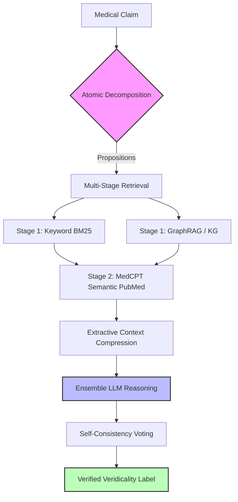

======================================================================
  ClinProof Comprehensive Analysis
  Results dir: results/v5_ablations/
======================================================================

## CLINPROOF ARCHITECTURE

---

## 1. ACCURACY SUMMARY

| Tag                                           | Dataset     | Model                         | Decomp | KG | BM25 | PMed | Rec | Votes | N   | Acc   | P     | R     | F1    | Unan% |
|-----------------------------------------------|-------------|-------------------------------|--------|----|------|------|-----|-------|-----|-------|-------|-------|-------|-------|
| A3_biomistral_bioasq                          | bioasq      | biomistral                    | ✓      | ✗  | ✓    | ✗    | 0.0 | 1     | 166 | 81.9% | 41.0% | 50.0% | 45.0% | 100%  |
| A5_mistral7b_bioasq                           | bioasq      | mistral                       | ✓      | ✗  | ✓    | ✗    | 0.0 | 1     | 166 | 80.7% | 67.6% | 58.4% | 60.5% | 100%  |
| A6_qwen14b_nokgbm25_bioasq                    | bioasq      | qwen2.5                       | ✓      | ✗  | ✓    | ✗    | 0.0 | 3     | 166 | 79.5% | 66.4% | 68.0% | 67.1% | 87%   |
| C1_bm25_flat_medchangeqa                      | medchangeqa | qwen2.5                       | ✓      | ✗  | ✓    | ✗    | 0.0 | 3     | 512 | 26.6% | 25.6% | 21.7% | 20.8% | 81%   |
| C2_bm25_recency_a0.3_medchangeqa              | medchangeqa | qwen2.5                       | ✓      | ✗  | ✓    | ✗    | 0.3 | 3     | 512 | 26.6% | 25.8% | 21.5% | 20.7% | 82%   |
| C3_bm25_recency_a0.7_medchangeqa              | medchangeqa | qwen2.5                       | ✓      | ✗  | ✓    | ✗    | 0.7 | 3     | 451 | 22.4% | 19.9% | 17.1% | 16.8% | 77%   |
| D1_qwen14b_1vote_bioasq                       | bioasq      | qwen2.5                       | ✓      | ✗  | ✓    | ✗    | 0.0 | 1     | 166 | 77.1% | 63.9% | 66.5% | 64.9% | 100%  |
| D2_qwen14b_3vote_bioasq                       | bioasq      | qwen2.5                       | ✓      | ✗  | ✓    | ✗    | 0.0 | 3     | 166 | 80.1% | 67.1% | 68.4% | 67.7% | 89%   |
| D4_medensemble_3_bioasq                       | bioasq      | meditron,medllama2,biomistral | ✓      | ✗  | ✓    | ✗    | 0.0 | 3     | 166 | 81.9% | 41.0% | 50.0% | 45.0% | 92%   |
| D5_hybridensemble_3_bioasq                    | bioasq      | qwen2.5,meditron,llama3.1     | ✓      | ✗  | ✓    | ✗    | 0.0 | 3     | 166 | 83.7% | 72.7% | 64.1% | 66.5% | 67%   |
| E1_qwen14b_3vote_with_decomp_healthfc_test    | healthfc    | qwen2.5                       | ✓      | ✗  | ✓    | ✗    | 0.0 | 3     | 75  | 53.3% | 47.6% | 44.8% | 45.4% | 83%   |
| E2_qwen14b_3vote_no_decomp_healthfc_test      | healthfc    | qwen2.5                       | ✓      | ✗  | ✓    | ✗    | 0.0 | 3     | 75  | 30.7% | 53.8% | 33.7% | 25.8% | 71%   |
| F2_qwen14b_recency0.3_with_decomp_medchangeqa | medchangeqa | qwen2.5                       | ✓      | ✗  | ✓    | ✗    | 0.3 | 3     | 512 | 26.6% | 26.7% | 21.7% | 21.3% | 79%   |

## 2. PER-CLASS PRECISION / RECALL / F1

  [A3] BIOASQ  Model=biomistral  n=166

| Class | Precision | Recall | F1    | Support | TP  |
|-------|-----------|--------|-------|---------|-----|
| No    | 0.0%      | 0.0%   | 0.0%  | 30      | 0   |
| Yes   | 81.9%     | 100.0% | 90.1% | 136     | 136 |
  → Macro-F1: 45.0%  |  Unanimous: 100%  |  AvgWinnerFrac: 1.00

  [A5] BIOASQ  Model=mistral  n=166

| Class | Precision | Recall | F1    | Support | TP  |
|-------|-----------|--------|-------|---------|-----|
| No    | 50.0%     | 23.3%  | 31.8% | 30      | 7   |
| Yes   | 85.2%     | 93.4%  | 89.1% | 136     | 127 |
  → Macro-F1: 60.5%  |  Unanimous: 100%  |  AvgWinnerFrac: 1.00

  [A6] BIOASQ  Model=qwen2.5  n=166

| Class | Precision | Recall | F1    | Support | TP  |
|-------|-----------|--------|-------|---------|-----|
| No    | 44.1%     | 50.0%  | 46.9% | 30      | 15  |
| Yes   | 88.6%     | 86.0%  | 87.3% | 136     | 117 |
  → Macro-F1: 67.1%  |  Unanimous: 87%  |  AvgWinnerFrac: 0.96

  [C1] MEDCHANGEQA  Model=qwen2.5  n=512

| Class                  | Precision | Recall | F1    | Support | TP  |
|------------------------|-----------|--------|-------|---------|-----|
| NOT ENOUGH INFORMATION | 0.0%      | 0.0%   | 0.0%  | 160     | 0   |
| REFUTED                | 33.3%     | 8.4%   | 13.4% | 131     | 11  |
| SUPPORTED              | 43.4%     | 56.6%  | 49.1% | 221     | 125 |
  → Macro-F1: 20.8%  |  Unanimous: 81%  |  AvgWinnerFrac: 0.94

  [C2] MEDCHANGEQA  Model=qwen2.5  n=512

| Class                  | Precision | Recall | F1    | Support | TP  |
|------------------------|-----------|--------|-------|---------|-----|
| NOT ENOUGH INFORMATION | 0.0%      | 0.0%   | 0.0%  | 160     | 0   |
| REFUTED                | 33.3%     | 7.6%   | 12.4% | 131     | 10  |
| SUPPORTED              | 44.2%     | 57.0%  | 49.8% | 221     | 126 |
  → Macro-F1: 20.7%  |  Unanimous: 82%  |  AvgWinnerFrac: 0.94

  [C3] MEDCHANGEQA  Model=qwen2.5  n=451

| Class                  | Precision | Recall | F1    | Support | TP |
|------------------------|-----------|--------|-------|---------|----|
| NOT ENOUGH INFORMATION | 0.0%      | 0.0%   | 0.0%  | 135     | 0  |
| REFUTED                | 16.7%     | 2.6%   | 4.5%  | 115     | 3  |
| SUPPORTED              | 43.2%     | 48.8%  | 45.8% | 201     | 98 |
  → Macro-F1: 16.8%  |  Unanimous: 77%  |  AvgWinnerFrac: 0.92

  [D1] BIOASQ  Model=qwen2.5  n=166

| Class | Precision | Recall | F1    | Support | TP  |
|-------|-----------|--------|-------|---------|-----|
| No    | 39.5%     | 50.0%  | 44.1% | 30      | 15  |
| Yes   | 88.3%     | 83.1%  | 85.6% | 136     | 113 |
  → Macro-F1: 64.9%  |  Unanimous: 100%  |  AvgWinnerFrac: 1.00

  [D2] BIOASQ  Model=qwen2.5  n=166

| Class | Precision | Recall | F1    | Support | TP  |
|-------|-----------|--------|-------|---------|-----|
| No    | 45.5%     | 50.0%  | 47.6% | 30      | 15  |
| Yes   | 88.7%     | 86.8%  | 87.7% | 136     | 118 |
  → Macro-F1: 67.7%  |  Unanimous: 89%  |  AvgWinnerFrac: 0.96

  [D4] BIOASQ  Model=meditron,medllama2,biomis  n=166

| Class | Precision | Recall | F1    | Support | TP  |
|-------|-----------|--------|-------|---------|-----|
| No    | 0.0%      | 0.0%   | 0.0%  | 30      | 0   |
| Yes   | 81.9%     | 100.0% | 90.1% | 136     | 136 |
  → Macro-F1: 45.0%  |  Unanimous: 92%  |  AvgWinnerFrac: 0.97

  [D5] BIOASQ  Model=qwen2.5,meditron,llama3.1  n=166

| Class | Precision | Recall | F1    | Support | TP  |
|-------|-----------|--------|-------|---------|-----|
| No    | 58.8%     | 33.3%  | 42.6% | 30      | 10  |
| Yes   | 86.6%     | 94.9%  | 90.5% | 136     | 129 |
  → Macro-F1: 66.5%  |  Unanimous: 67%  |  AvgWinnerFrac: 0.89

  [E1] HEALTHFC  Model=qwen2.5  n=75

| Class   | Precision | Recall | F1    | Support | TP |
|---------|-----------|--------|-------|---------|----|
| False   | 28.6%     | 28.6%  | 28.6% | 14      | 4  |
| Mixture | 60.4%     | 70.7%  | 65.2% | 41      | 29 |
| True    | 53.8%     | 35.0%  | 42.4% | 20      | 7  |
  → Macro-F1: 45.4%  |  Unanimous: 83%  |  AvgWinnerFrac: 0.94

  [E2] HEALTHFC  Model=qwen2.5  n=75

| Class   | Precision | Recall | F1    | Support | TP |
|---------|-----------|--------|-------|---------|----|
| False   | 22.0%     | 64.3%  | 32.7% | 14      | 9  |
| Mixture | 39.4%     | 31.7%  | 35.1% | 41      | 13 |
| True    | 100.0%    | 5.0%   | 9.5%  | 20      | 1  |
  → Macro-F1: 25.8%  |  Unanimous: 71%  |  AvgWinnerFrac: 0.90

  [F2] MEDCHANGEQA  Model=qwen2.5  n=512

| Class                  | Precision | Recall | F1    | Support | TP  |
|------------------------|-----------|--------|-------|---------|-----|
| NOT ENOUGH INFORMATION | 0.0%      | 0.0%   | 0.0%  | 160     | 0   |
| REFUTED                | 34.4%     | 8.4%   | 13.5% | 131     | 11  |
| SUPPORTED              | 45.6%     | 56.6%  | 50.5% | 221     | 125 |
  → Macro-F1: 21.3%  |  Unanimous: 79%  |  AvgWinnerFrac: 0.93

## 3. ERROR ANALYSIS (Wrong Predictions)

  [A3] BIOASQ
  Wrong=30  Correct=136
  Error categories: {'unanimous_wrong': 30}
  Wrong pred dist:  {'A': 30}
  Confusion (gt→pred): {'B': {'A': 30}}

  Sample wrong cases (first 3):

    ID=58dbb4f08acda3452900001a
    Q : Is Lennox-Gastaut Syndrome usually diagnosed in older adults?
    GT: B  PRED: Yes  Votes: {'A': 1}
    Context: 
Document [1] (Title: Atomic Propositions)  Key medical claims to verify:

- Lennox-Gastaut Syndrome ...
    Reasoning: ...

    ID=5540a8d20083d1bf0e000001
    Q : Does a selective sweep increase genetic variation?
    GT: B  PRED: Yes  Votes: {'A': 1}
    Context:
Document [1] (Title: Atomic Propositions)  Key medical claims to verify:
- a selective sweep can in...
    Reasoning: ...

    ID=5a8714e261bb38fb24000005
    Q : Is polyadenylation a process that stabilizes a protein by adding a string of Adenosine residues to the end of the molecu
    GT: B  PRED: Yes  Votes: {'A': 1}
    Context:
Document [1] (Title: Atomic Propositions)  Key medical claims to verify:
- polyadenylation is a pro...
    Reasoning: ...

  [A5] BIOASQ
  Wrong=32  Correct=134
  Error categories: {'unanimous_wrong': 32}
  Wrong pred dist:  {'B': 7, 'A': 22, 'C': 2, 'D': 1}
  Confusion (gt→pred): {'A': {'B': 7, 'C': 1, 'D': 1}, 'B': {'A': 22, 'C': 1}}

  Sample wrong cases (first 3):

    ID=5321bb019b2d7acc7e00000b
    Q : Is low T3 syndrome related with high BNP in cardiac patients?
    GT: A  PRED: No  Votes: {'B': 1}
    Context:
Document [1] (Title: Atomic Propositions)  Key medical claims to verify:
- low T3 levels are associ...
    Reasoning: {"step_by_step_thinking": [
"Document [2] discusses the low T3 syndrome (low total and unbound T3 levels) in sick euthyroid syndrome. This condition m...

    ID=5540a8d20083d1bf0e000001
    Q : Does a selective sweep increase genetic variation?
    GT: B  PRED: Yes  Votes: {'A': 1}
    Context:
Document [1] (Title: Atomic Propositions)  Key medical claims to verify:
- a selective sweep can in...
    Reasoning: {"step_by_step_thinking": ["Document [4] discusses the presence of mobile genetic elements that can move within the genome, which is a form of genetic...

    ID=5a8714e261bb38fb24000005
    Q : Is polyadenylation a process that stabilizes a protein by adding a string of Adenosine residues to the end of the molecu
    GT: B  PRED: Yes  Votes: {'A': 1}
    Context:
Document [1] (Title: Atomic Propositions)  Key medical claims to verify:
- polyadenylation is a pro...
    Reasoning: {"step_by_step_thinking": ["The question asks whether polyadenylation is a process that stabilizes a protein by adding a string of Adenosine residues ...

  [A6] BIOASQ
  Wrong=34  Correct=132
  Error categories: {'split_vote_wrong': 10, 'unanimous_wrong': 24}
  Wrong pred dist:  {'A': 15, 'B': 19}
  Confusion (gt→pred): {'B': {'A': 15}, 'A': {'B': 19}}

  Sample wrong cases (first 3):

    ID=5540a8d20083d1bf0e000001
    Q : Does a selective sweep increase genetic variation?
    GT: B  PRED: Yes  Votes: {'A': 2, 'B': 1}
    Context:
Document [1] (Title: Atomic Propositions)  Key medical claims to verify:
- a selective sweep can in...
    Reasoning: The concept of a 'selective sweep' is not explicitly defined in the documents provided, but it can be inferred that this term refers to an evolutionar...

    ID=58bbb68b22d3005309000015
    Q : Has "RNA interference" been awarded Nobel prize?
    GT: A  PRED: No  Votes: {'B': 3}
    Context:
Document [1] (Title: Atomic Propositions)  Key medical claims to verify:
- RNA interference has not...
    Reasoning: Document [1] explicitly states that RNA interference has not been awarded a Nobel Prize. There is no other document in the provided list that mentions...

    ID=56c0708eef6e39474100001f
    Q : Is the abnormal dosage of ultraconserved elements disfavored in cancer cells?
    GT: B  PRED: Yes  Votes: {'A': 3}
    Context:
Document [1] (Title: Atomic Propositions)  Key medical claims to verify:
- abnormal dosage of ultra...
    Reasoning: Document [1] explicitly states that an abnormal dosage of ultraconserved elements is disfavored in cancer cells, which directly supports the statement...

  [C1] MEDCHANGEQA
  Wrong=312  Correct=200
  Error categories: {'unanimous_wrong': 252, 'split_vote_wrong': 60}
  Wrong pred dist:  {'B': 22, 'C': 127, 'A': 163}
  Confusion (gt→pred): {'A': {'B': 10, 'C': 86}, 'B': {'A': 79, 'C': 41}, 'C': {'B': 12, 'A': 84}}

  Sample wrong cases (first 3):

    ID=q_0
    Q : Is cranberry juice effective for treating urinary tract infections?
    GT: SUPPORTED  PRED: REFUTED  Votes: {'B': 3}
    Context:
Document [1] (Title: Atomic Propositions)  Key medical claims to verify:
- cranberry juice may help...
    Reasoning: The core medical claim is whether cranberry juice is effective for treating urinary tract infections. Document [2] states that prevention by urine aci...

    ID=q_3
    Q : Do antibiotics effectively reduce pain in children with acute otitis media?
    GT: SUPPORTED  PRED: NOT ENOUGH INFORMATION  Votes: {'C': 2, 'A': 1}
    Context:
Document [1] (Title: Atomic Propositions)  Key medical claims to verify:
- antibiotics reduce pain ...
    Reasoning: The core medical claim is whether antibiotics effectively reduce pain in children with acute otitis media. Document [2] mentions that a higher proport...

    ID=q_4
    Q : Does cell salvage reduce the need for blood transfusions in elective surgery?
    GT: REFUTED  PRED: SUPPORTED  Votes: {'A': 3}
    Context:
Document [1] (Title: Atomic Propositions)  Key medical claims to verify:
- cell salvage reduces the...
    Reasoning: The core medical claim is that cell salvage reduces the need for blood transfusions in elective surgery. Document [1] directly states this as a key me...

  [C2] MEDCHANGEQA
  Wrong=314  Correct=198
  Error categories: {'split_vote_wrong': 56, 'unanimous_wrong': 258}
  Wrong pred dist:  {'B': 20, 'A': 159, 'C': 135}
  Confusion (gt→pred): {'A': {'B': 11, 'C': 84}, 'B': {'A': 70, 'C': 51}, 'C': {'A': 89, 'B': 9}}

  Sample wrong cases (first 3):

    ID=q_0
    Q : Is cranberry juice effective for treating urinary tract infections?
    GT: SUPPORTED  PRED: REFUTED  Votes: {'B': 2, 'C': 1}
    Context:
Document [1] (Title: Atomic Propositions)  Key medical claims to verify:
- cranberry juice may help...
    Reasoning: The core medical claim is whether cranberry juice is effective for treating urinary tract infections (UTIs). Document [1] states that there is limited...

    ID=q_4
    Q : Does cell salvage reduce the need for blood transfusions in elective surgery?
    GT: REFUTED  PRED: SUPPORTED  Votes: {'A': 3}
    Context:
Document [1] (Title: Atomic Propositions)  Key medical claims to verify:
- cell salvage reduces the...
    Reasoning: The core medical claim is that cell salvage reduces the need for blood transfusions in elective surgery. Document [1] directly states this claim as a ...

    ID=q_5
    Q : Can interventions help prevent kidney complications in people with sickle cell disease?
    GT: SUPPORTED  PRED: NOT ENOUGH INFORMATION  Votes: {'C': 2, 'A': 1}
    Context:
Document [1] (Title: Atomic Propositions)  Key medical claims to verify:
- interventions can help p...
    Reasoning: The core medical claim is whether interventions can help prevent kidney complications in people with sickle cell disease. Document [2] mentions that e...

  [C3] MEDCHANGEQA
  Wrong=289  Correct=162
  Error categories: {'split_vote_wrong': 63, 'unanimous_wrong': 226}
  Wrong pred dist:  {'B': 15, 'C': 145, 'A': 129}
  Confusion (gt→pred): {'A': {'B': 10, 'C': 93}, 'B': {'A': 60, 'C': 52}, 'C': {'A': 69, 'B': 5}}

  Sample wrong cases (first 3):

    ID=q_0
    Q : Is cranberry juice effective for treating urinary tract infections?
    GT: SUPPORTED  PRED: REFUTED  Votes: {'B': 2, 'C': 1}
    Context:
Document [1] (Title: Atomic Propositions)  Key medical claims to verify:
- cranberry juice may help...
    Reasoning: The core medical claim is whether cranberry juice is effective for treating urinary tract infections. Document [1] states that there is limited eviden...

    ID=q_3
    Q : Do antibiotics effectively reduce pain in children with acute otitis media?
    GT: SUPPORTED  PRED: NOT ENOUGH INFORMATION  Votes: {'C': 3}
    Context:
Document [1] (Title: Atomic Propositions)  Key medical claims to verify:
- antibiotics reduce pain ...
    Reasoning: The core medical claim is whether antibiotics effectively reduce pain in children with acute otitis media. Document [2] discusses the debate on antibi...

    ID=q_4
    Q : Does cell salvage reduce the need for blood transfusions in elective surgery?
    GT: REFUTED  PRED: SUPPORTED  Votes: {'A': 3}
    Context:
Document [1] (Title: Atomic Propositions)  Key medical claims to verify:
- cell salvage reduces the...
    Reasoning: The core medical claim is that cell salvage reduces the need for blood transfusions in elective surgery. Document [5] discusses intraoperative blood s...

  [D1] BIOASQ
  Wrong=38  Correct=128
  Error categories: {'unanimous_wrong': 38}
  Wrong pred dist:  {'B': 23, 'A': 15}
  Confusion (gt→pred): {'A': {'B': 23}, 'B': {'A': 15}}

  Sample wrong cases (first 3):

    ID=5321bb019b2d7acc7e00000b
    Q : Is low T3 syndrome related with high BNP in cardiac patients?
    GT: A  PRED: No  Votes: {'B': 1}
    Context:
Document [1] (Title: Atomic Propositions)  Key medical claims to verify:
- low T3 levels are associ...
    Reasoning: To determine if low T3 syndrome is related to high BNP levels, we need to examine the evidence provided in the documents. Document [2] describes sick ...

    ID=5aa395fcd6d6b54f79000007
    Q : Has rituximab been considered as a treatment for chronic fatigues syndrome? (November 2017)
    GT: A  PRED: No  Votes: {'B': 1}
    Context:
Document [1] (Title: Atomic Propositions)  Key medical claims to verify:
- rituximab has been studi...
    Reasoning: The provided documents do not contain any explicit information about rituximab being considered as a treatment for chronic fatigue syndrome. Document ...

    ID=5540a8d20083d1bf0e000001
    Q : Does a selective sweep increase genetic variation?
    GT: B  PRED: Yes  Votes: {'A': 1}
    Context:
Document [1] (Title: Atomic Propositions)  Key medical claims to verify:
- a selective sweep can in...
    Reasoning: Document [1] states that a selective sweep can increase genetic variation, which directly supports the statement in the question. There is no evidence...

  [D2] BIOASQ
  Wrong=33  Correct=133
  Error categories: {'unanimous_wrong': 24, 'split_vote_wrong': 9}
  Wrong pred dist:  {'B': 18, 'A': 15}
  Confusion (gt→pred): {'A': {'B': 18}, 'B': {'A': 15}}

  Sample wrong cases (first 3):

    ID=5321bb019b2d7acc7e00000b
    Q : Is low T3 syndrome related with high BNP in cardiac patients?
    GT: A  PRED: No  Votes: {'B': 3}
    Context:
Document [1] (Title: Atomic Propositions)  Key medical claims to verify:
- low T3 syndrome is assoc...
    Reasoning: Document [1] suggests a relationship between low T3 syndrome and high BNP levels, but it does not provide specific evidence or context for this associ...

    ID=58a337af60087bc10a000016
    Q : Is treatment resistant depression related to vitamin B9?
    GT: A  PRED: No  Votes: {'B': 3}
    Context:
Document [1] (Title: Atomic Propositions)  Key medical claims to verify:
- vitamin B9 deficiency ca...
    Reasoning: Document [1] explicitly states that vitamin B9 deficiency can cause depression, but it does not mention treatment-resistant depression specifically. D...

    ID=5540a8d20083d1bf0e000001
    Q : Does a selective sweep increase genetic variation?
    GT: B  PRED: Yes  Votes: {'A': 3}
    Context:
Document [1] (Title: Atomic Propositions)  Key medical claims to verify:
- a selective sweep can in...
    Reasoning: Document [1] explicitly states that 'a selective sweep can increase genetic variation.' This is the only document that directly addresses and confirms...

  [D4] BIOASQ
  Wrong=30  Correct=136
  Error categories: {'unanimous_wrong': 26, 'split_vote_wrong': 4}
  Wrong pred dist:  {'A': 30}
  Confusion (gt→pred): {'B': {'A': 30}}

  Sample wrong cases (first 3):

    ID=58dbb4f08acda3452900001a
    Q : Is Lennox-Gastaut Syndrome usually diagnosed in older adults?
    GT: B  PRED: Yes  Votes: {'A': 3}
    Context:
Document [1] (Title: Atomic Propositions)  Key medical claims to verify:
- Lennox-Gastaut Syndrome ...
    Reasoning: Relevant documents:
Document [1] (Title: Atomic Propositions)  Key medical claims to verify:
- Lennox-Gastaut Syndrome is typically diagnosed in older...

    ID=5540a8d20083d1bf0e000001
    Q : Does a selective sweep increase genetic variation?
    GT: B  PRED: Yes  Votes: {'A': 3}
    Context:
Document [1] (Title: Atomic Propositions)  Key medical claims to verify:
- a selective sweep can in...
    Reasoning: ......

    ID=5a8714e261bb38fb24000005
    Q : Is polyadenylation a process that stabilizes a protein by adding a string of Adenosine residues to the end of the molecu
    GT: B  PRED: Yes  Votes: {'A': 3}
    Context:
Document [1] (Title: Atomic Propositions)  Key medical claims to verify:
- polyadenylation is a pro...
    Reasoning: ...

  [D5] BIOASQ
  Wrong=27  Correct=139
  Error categories: {'split_vote_wrong': 17, 'unanimous_wrong': 10}
  Wrong pred dist:  {'A': 20, 'B': 7}
  Confusion (gt→pred): {'B': {'A': 20}, 'A': {'B': 7}}

  Sample wrong cases (first 3):

    ID=5540a8d20083d1bf0e000001
    Q : Does a selective sweep increase genetic variation?
    GT: B  PRED: Yes  Votes: {'A': 2, 'B': 1}
    Context:
Document [1] (Title: Atomic Propositions)  Key medical claims to verify:
- a selective sweep can in...
    Reasoning: The provided documents do not directly address the concept of a 'selective sweep' or its effect on genetic variation. However, Document [1] mentions t...

    ID=5a8714e261bb38fb24000005
    Q : Is polyadenylation a process that stabilizes a protein by adding a string of Adenosine residues to the end of the molecu
    GT: B  PRED: Yes  Votes: {'B': 1, 'A': 2}
    Context:
Document [1] (Title: Atomic Propositions)  Key medical claims to verify:
- polyadenylation is a pro...
    Reasoning: Document [1] states that polyadenylation is a process that stabilizes a protein by adding a string of Adenosine residues to the end of the molecule. H...

    ID=58bbb68b22d3005309000015
    Q : Has "RNA interference" been awarded Nobel prize?
    GT: A  PRED: No  Votes: {'B': 2, 'A': 1}
    Context:
Document [1] (Title: Atomic Propositions)  Key medical claims to verify:
- RNA interference has not...
    Reasoning: Document [1] explicitly states that RNA interference has not been awarded a Nobel Prize. There is no other document that contradicts or supports the a...

  [E1] HEALTHFC
  Wrong=27  Correct=48
  Error categories: {'split_vote_wrong': 6, 'unanimous_wrong': 21}
  Wrong pred dist:  {'A': 13, 'B': 14}
  Confusion (gt→pred): {'C': {'A': 13, 'B': 14}}

  Sample wrong cases (first 3):

    ID=hfc_test_2
    Q : Can regular exercise prevent or relieve migraine symptoms?
    GT: 0  PRED: True  Votes: {'A': 2, 'C': 1}
    Context:
Document [1] (Title: Atomic Propositions)  Key medical claims to verify:
- Regular exercise can hel...
    Reasoning: The core health claim is that regular exercise can help manage or prevent migraine symptoms. Document [1] directly supports this by stating 'Regular e...

    ID=hfc_test_3
    Q : Can the genetic blood test for Down syndrome (trisomy 21) predict whether the unborn child is affected - in pregnant wom
    GT: 0  PRED: True  Votes: {'A': 2, 'C': 1}
    Context:
Document [1] (Title: Atomic Propositions)  Key medical claims to verify:
- the genetic blood test f...
    Reasoning: The core claim is about the ability of genetic blood tests to predict Down syndrome in unborn children for pregnant women at increased risk. Document ...

    ID=hfc_test_4
    Q : Does hydroxychloroquine prevent covid-19 infection???
    GT: 2  PRED: False  Votes: {'B': 3}
    Context:
Document [1] (Title: Atomic Propositions)  Key medical claims to verify:
- hydroxychloroquine is ef...
    Reasoning: The core health claim is whether hydroxychloroquine prevents COVID-19 infection. Document [1] specifically addresses this question and states that hyd...

  [E2] HEALTHFC
  Wrong=42  Correct=33
  Error categories: {'unanimous_wrong': 32, 'split_vote_wrong': 10}
  Wrong pred dist:  {'B': 41, 'A': 1}
  Confusion (gt→pred): {'C': {'B': 41, 'A': 1}}

  Sample wrong cases (first 3):

    ID=hfc_test_2
    Q : Can regular exercise prevent or relieve migraine symptoms?
    GT: 0  PRED: False  Votes: {'B': 3}
    Context:
Document [1] (Title: InternalMed_Harrison)  InternalMed_Harrison. Exercise and Physical Activity In...
    Reasoning: The core health claim is whether regular exercise can prevent or relieve migraine symptoms. Document [2] mentions that it is unclear if migraine can c...

    ID=hfc_test_3
    Q : Can the genetic blood test for Down syndrome (trisomy 21) predict whether the unborn child is affected - in pregnant wom
    GT: 0  PRED: True  Votes: {'C': 1, 'A': 2}
    Context:
Document [1] (Title: InternalMed_Harrison)  InternalMed_Harrison. Traditional approach to genetic t...
    Reasoning: The core claim is whether genetic blood tests for Down syndrome (trisomy 21) can predict if an unborn child is affected in pregnant women at increased...

    ID=hfc_test_4
    Q : Does hydroxychloroquine prevent covid-19 infection???
    GT: 2  PRED: False  Votes: {'B': 3}
    Context:
Document [1] (Title: InternalMed_Harrison)  InternalMed_Harrison. Some authorities recommend that p...
    Reasoning: The core health claim is whether hydroxychloroquine prevents COVID-19 infection. The provided documents do not contain any information about the use o...

  [F2] MEDCHANGEQA
  Wrong=306  Correct=206
  Error categories: {'split_vote_wrong': 57, 'unanimous_wrong': 249}
  Wrong pred dist:  {'B': 21, 'A': 149, 'C': 136}
  Confusion (gt→pred): {'A': {'B': 10, 'C': 86}, 'B': {'A': 70, 'C': 50}, 'C': {'B': 11, 'A': 79}}

  Sample wrong cases (first 3):

    ID=q_0
    Q : Is cranberry juice effective for treating urinary tract infections?
    GT: SUPPORTED  PRED: REFUTED  Votes: {'B': 2, 'C': 1}
    Context:
Document [1] (Title: Atomic Propositions)  Key medical claims to verify:
- cranberry juice may help...
    Reasoning: The core medical claim is whether cranberry juice is effective for treating urinary tract infections. Document [1] states there is limited evidence fo...

    ID=q_4
    Q : Does cell salvage reduce the need for blood transfusions in elective surgery?
    GT: REFUTED  PRED: SUPPORTED  Votes: {'A': 3}
    Context:
Document [1] (Title: Atomic Propositions)  Key medical claims to verify:
- cell salvage reduces the...
    Reasoning: The core medical claim is that cell salvage reduces the need for blood transfusions in elective surgery. Document [1] directly addresses this claim an...

    ID=q_5
    Q : Can interventions help prevent kidney complications in people with sickle cell disease?
    GT: SUPPORTED  PRED: NOT ENOUGH INFORMATION  Votes: {'C': 2, 'A': 1}
    Context:
Document [1] (Title: Atomic Propositions)  Key medical claims to verify:
- interventions can help p...
    Reasoning: The core medical claim is whether interventions can help prevent kidney complications in people with sickle cell disease. Document [2] mentions that e...

## 4. SOTA COMPARISON

  Dataset: BIOASQ

| System                                  | Accuracy | Macro-F1 |
|-----------------------------------------|----------|----------|
| Vladika and Matthes [44]                | —        | 61.7%    |
| Lan et al. [30]                         | —        | 60.1%    |
| Bekoulis et al. [8]                     | —        | 49.8%    |
| ClinProof (qwen2.5,meditron,lla) [BEST] | 83.7%    | 66.5%    |

  Dataset: MEDCHANGEQA

| System                        | Accuracy | Macro-F1 |
|-------------------------------|----------|----------|
| BioMistral 7B (Latest Labels) | 35.4%    | 35.3%    |
| Llama 3.3 70B (Latest Labels) | 42.8%    | 34.1%    |
| Mistral 24B (Latest Labels)   | 36.9%    | 33.7%    |
| OLMo 2 13B (Latest Labels)    | 35.5%    | 33.2%    |
| GPT-4o (Latest Labels)        | 35.2%    | 31.1%    |
| ClinProof (qwen2.5) [BEST]    | 26.6%    | 20.8%    |

  Dataset: HEALTHFC

| System                     | Accuracy | Macro-F1 |
|----------------------------|----------|----------|
| Vladika et al. [45] (Best) | —        | 67.5%    |
| Bekoulis et al. [8]        | —        | 45.2%    |
| Vladika and Matthes [44]   | —        | 40.6%    |
| ClinProof (qwen2.5) [BEST] | 53.3%    | 45.4%    |

  Dataset: SCIFACT

| System                     | Accuracy | Macro-F1 |
|----------------------------|----------|----------|
| Bekoulis et al. [8] (Best) | —        | 52.6%    |
| Vladika and Matthes [44]   | —        | 44.1%    |
| Zaheer et al. [53]         | —        | 36.9%    |

  Dataset: MEDQA

| System           | Accuracy | Macro-F1 |
|------------------|----------|----------|
| MedRAG (GPT-3.5) | 74.3%    | —        |
| GPT-4 zero-shot  | 87.0%    | —        |

## 6. NEI / CONSERVATIVE BIAS DIAGNOSIS

  (Checking if model over-predicts 'safe' answers: NEI, No, False)

  [A3] BIOASQ  n=166
     A: gt= 136 (82%)  pred= 166 (100%)  bias=+18% ← BIASED

  [A5] BIOASQ  n=166
     A: gt= 136 (82%)  pred= 149 (90%)  bias=+8%
     B: gt=  30 (18%)  pred=  14 (8%)  bias=-10%
     C: gt=   0 (0%)  pred=   2 (1%)  bias=+1%
     D: gt=   0 (0%)  pred=   1 (1%)  bias=+1%

  [A6] BIOASQ  n=166
     A: gt= 136 (82%)  pred= 132 (80%)  bias=-2%
     B: gt=  30 (18%)  pred=  34 (20%)  bias=+2%

  [C1] MEDCHANGEQA  n=512
     A: gt= 221 (43%)  pred= 288 (56%)  bias=+13% ← BIASED
     B: gt= 131 (26%)  pred=  33 (6%)  bias=-19% ← BIASED
     C: gt= 160 (31%)  pred= 191 (37%)  bias=+6%

  [C2] MEDCHANGEQA  n=512
     A: gt= 221 (43%)  pred= 285 (56%)  bias=+12% ← BIASED
     B: gt= 131 (26%)  pred=  30 (6%)  bias=-20% ← BIASED
     C: gt= 160 (31%)  pred= 197 (38%)  bias=+7%

  [C3] MEDCHANGEQA  n=451
     A: gt= 201 (45%)  pred= 227 (50%)  bias=+6%
     B: gt= 115 (25%)  pred=  18 (4%)  bias=-22% ← BIASED
     C: gt= 135 (30%)  pred= 206 (46%)  bias=+16% ← BIASED

  [D1] BIOASQ  n=166
     A: gt= 136 (82%)  pred= 128 (77%)  bias=-5%
     B: gt=  30 (18%)  pred=  38 (23%)  bias=+5%

  [D2] BIOASQ  n=166
     A: gt= 136 (82%)  pred= 133 (80%)  bias=-2%
     B: gt=  30 (18%)  pred=  33 (20%)  bias=+2%

  [D4] BIOASQ  n=166
     A: gt= 136 (82%)  pred= 166 (100%)  bias=+18% ← BIASED

  [D5] BIOASQ  n=166
     A: gt= 136 (82%)  pred= 149 (90%)  bias=+8%
     B: gt=  30 (18%)  pred=  17 (10%)  bias=-8%

  [E1] HEALTHFC  n=75
     A: gt=   0 (0%)  pred=  13 (17%)  bias=+17% ← BIASED
     B: gt=   0 (0%)  pred=  14 (19%)  bias=+19% ← BIASED
     C: gt=  75 (100%)  pred=  48 (64%)  bias=-36% ← BIASED

  [E2] HEALTHFC  n=75
     A: gt=   0 (0%)  pred=   1 (1%)  bias=+1%
     B: gt=   0 (0%)  pred=  41 (55%)  bias=+55% ← BIASED
     C: gt=  75 (100%)  pred=  33 (44%)  bias=-56% ← BIASED

  [F2] MEDCHANGEQA  n=512
     A: gt= 221 (43%)  pred= 274 (54%)  bias=+10% ← BIASED
     B: gt= 131 (26%)  pred=  32 (6%)  bias=-19% ← BIASED
     C: gt= 160 (31%)  pred= 206 (40%)  bias=+9%

══════════════════════════════════════════════════════════════════════
  Analysis complete.
══════════════════════════════════════════════════════════════════════
